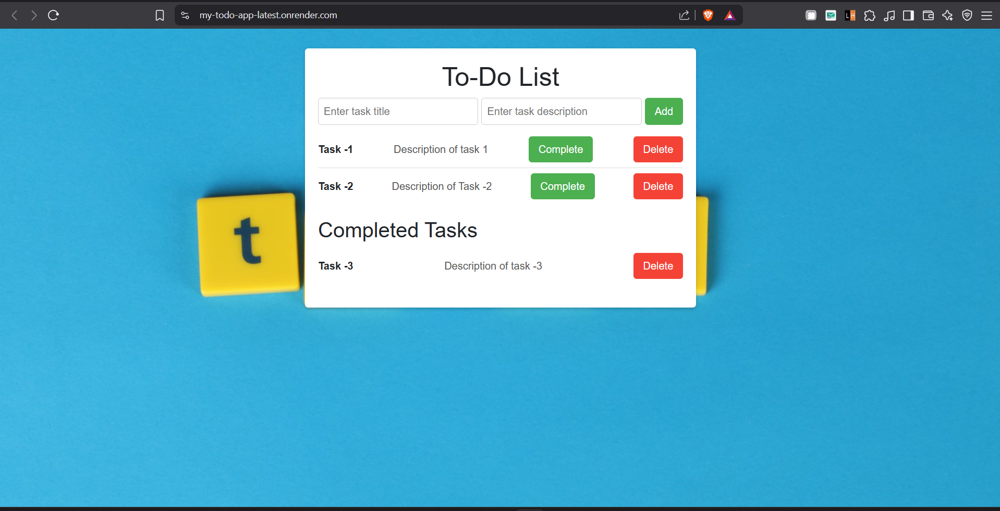
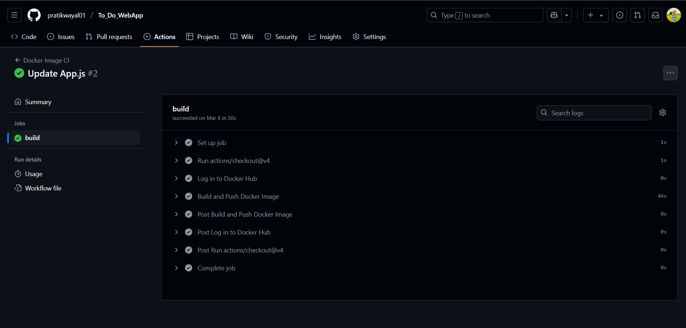
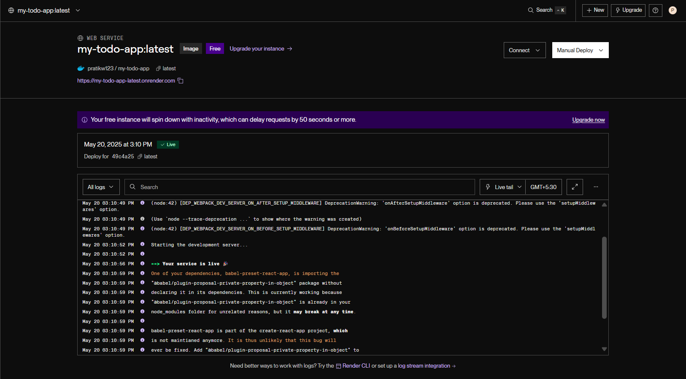
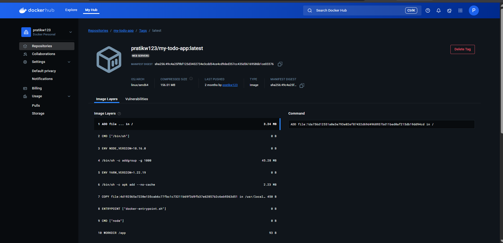

# ✅ To-Do Web App with CI/CD (React + Docker + GitHub Actions + Render)

A simple yet production-ready **To-Do Web Application** built using **React**, containerized with **Docker**, and automatically deployed to **Render** using **GitHub Actions**. This project demonstrates a full DevOps pipeline—from code to live deployment—with versioned Docker images, continuous integration, and continuous delivery.

---

## 🔧 Tech Stack

- **Frontend**: React
- **Containerization**: Docker, DockerHub
- **CI/CD Pipeline**: GitHub Actions
- **Deployment**: Render

---

## 🚀 Live Demo & Docker

- 🌐 **Live App**: [my-todo-app-latest.onrender.com](https://my-todo-app-latest.onrender.com/)  
  (Backup: [Netlify Deployment](https://to-do-web-app-pratik.netlify.app/))

- 📦 **DockerHub Image**: [pratikw123/my-todo-app](https://hub.docker.com/repository/docker/pratikw123/my-todo-app)

---

## 📸 Screenshots

| Description                     | Screenshot |
|---------------------------------|------------|
| ✅ Final Web App UI (Deployed)   |  |
| 🔁 GitHub Actions CI/CD Build   |  |
| 🔄 Render Deployment Log        |  |
| 📦 DockerHub Image              |  |

---

## ⚙️ Local Setup & Docker

```bash
# 1. Clone the repository
git clone https://github.com/pratikwayal01/To_Do_WebApp.git
cd To_Do_WebApp

# 2. Build Docker image
docker build -t todo-app .

# 3. Run the container
docker run -p 3000:3000 todo-app
````

Now, open your browser and visit `http://localhost:3000`

---

## 🔄 CI/CD & Deployment Flow

This project uses a fully automated DevOps pipeline:

### 1️⃣ GitHub Actions Workflow

* On each push to the `main` branch:

  * React app is built.
  * Docker image is created using the Dockerfile.
  * Image is pushed to DockerHub (`pratikw123/my-todo-app`).

📸 *See Screenshot:*


---

### 2️⃣ Render Deployment

* Render is configured to auto-deploy from the Docker image.
* After the image is pushed to DockerHub, Render:

  * Pulls the latest image.
  * Rebuilds and redeploys the app.

📸 *See Screenshot:*


---

## 📦 DockerHub

You can also pull and run the latest version directly:

```bash
docker pull pratikw123/my-todo-app
docker run -p 3000:3000 pratikw123/my-todo-app
```

📸 *See Screenshot:*


---

## 💡 Highlights

* ⚛️ Built with clean, modular React components.
* 🐳 Fully containerized with Docker.
* 🔁 Seamless CI/CD integration using GitHub Actions.
* ☁️ Automatically deployed via Docker image to Render.
* 🚀 Ready for production with minimal configuration.

---

## 👨‍💻 Author

**Pratik Wayal**
Feel free to connect with me on [LinkedIn](https://www.linkedin.com/in/pratikwayal/) or check out more of my projects on [GitHub](https://github.com/pratikwayal01).

---

## 📄 License

This project is licensed under the [MIT License](https://opensource.org/license/mit).
